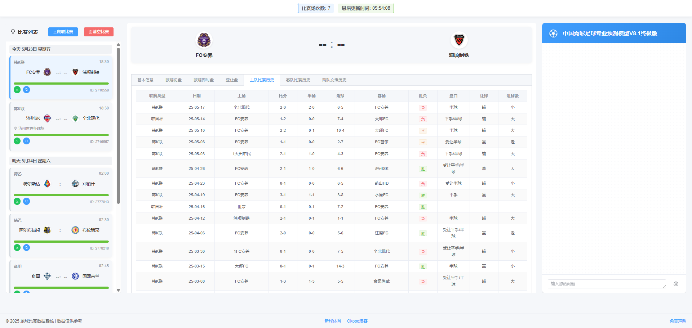
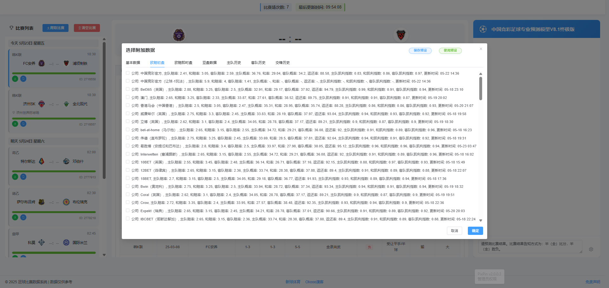
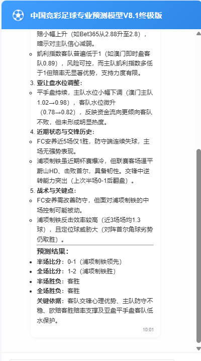

# 足球先知（Football Clairvoyant）

## 免责声明

本项目为非商业开源项目，仅供学习与技术研究使用。所有数据均通过 Playwright 浏览器自动化采集自公开网页，未获得原网站授权。**严禁任何形式的商业用途和倒卖，违者将依法追究法律责任。** 请勿将本项目及其数据用于任何商业用途或违法用途。若本项目内容或数据侵犯了您的权益或违反相关法律法规，请及时联系维护者（邮箱：tanqiyang058@gmail.com），我们将在第一时间删除相关内容及数据。

> ⚠️ 使用本项目即表示您已知悉并同意上述声明。

---

> ⚽ 专业的AI驱动型足球数据分析与预测平台，集成 DeepSeek AI，支持结构化数据爬取、智能对话、可扩展数据导出，助力用户高效洞察赛事本质。

---

## 项目界面预览

### 首页与比赛列表



> 首页展示全部比赛列表、实时数据、详细赛程与历史交锋，左侧可快速切换日期与赛事。

### 数据选择弹窗



> AI对话时可灵活选择附加数据（如欧赔、亚盘、历史战绩等），支持保存和应用预设，满足多样分析需求。

### AI分析结果示例



> AI模型基于多维数据自动生成专业分析与预测结果，涵盖盘口解读、状态对比、关键结论等。

---

## 项目简介

**足球先知** 以"数据驱动+AI智能"为核心理念，自动爬取主流足球赛事数据，结构化存储于本地 JSON 文件，并通过深度学习大模型（DeepSeek Reasoner/Chat）为用户提供专业的赛果预测、数据分析和交互式问答体验。平台前后端分离，支持灵活扩展和二次开发，适合数据分析师、竞彩玩家、开发者等多类用户。

- **前端**：Vue 3 + Element Plus，现代响应式界面，交互流畅
- **后端**：Node.js + Express，Socket.io 实时通信，Playwright 自动化爬虫
- **AI服务**：DeepSeek API，支持自定义模型、参数与提示词
- **数据导出**：Excel 一键导出，便于后续深度分析

---

## 主要功能与用户价值

- ⚡ **实时比赛数据爬取**：一键获取最新赛程、赔率、历史交锋等，适合快速掌握全局走势
- 📊 **多维度数据分析**：支持欧赔、亚盘、球队历史、交锋等多角度分析，助力科学决策
- 🤖 **AI智能预测与问答**：结合大模型推理能力，支持连续对话、上下文分析，适合快速获取专业建议
- 💬 **交互式AI聊天**：可针对具体比赛或泛足球话题进行智能问答，支持附加数据上下文
- 📁 **结构化数据导出**：一键导出为 Excel，便于自定义建模、批量统计、可视化分析
- 🖼️ **球队Logo智能管理**：自动爬取并缓存球队Logo，提升界面体验，减少重复请求

**典型场景举例：**
- 竞彩玩家可快速爬取并分析即将开赛的全部赛事，结合AI预测辅助投注
- 数据分析师可导出结构化Excel，配合 Cherry Studio 等工具进行深度建模
- 开发者可基于本地JSON数据二次开发，扩展更多自定义功能

---

## 功能与界面详细说明

### 主要按钮与设置项

- **爬取比赛**：
  - 入口：首页右上角"爬取比赛"按钮。
  - 功能：启动后端爬虫，自动抓取最新比赛列表和基础数据，随后自动异步爬取详细信息。
  - 交互流程：点击后前端显示进度，后端通过 WebSocket 实时推送爬取状态，数据完成后自动刷新页面。
  - 典型用法：每日赛前一键刷新全部数据，确保分析基于最新信息。

- **清空比赛**：
  - 入口：首页右上角"清空比赛"按钮。
  - 功能：一键删除所有已爬取比赛数据，便于重新采集或清理空间。
  - 交互流程：点击后前端确认，后端清空 `backend/match_json/` 目录，页面自动更新。

- **比赛卡片刷新按钮**：
  - 入口：每场比赛卡片左下角"刷新"图标按钮。
  - 功能：可重新爬取该场比赛的详细信息，适用于数据更新或修正。
  - 注意事项：如果原网站已无此比赛条目，点击刷新后的后果目前暂未充分测试，若遇到异常或BUG请及时反馈。

- **AI 聊天**：
  - 入口：独立AI聊天页。输入问题后回车会提示选择附加数据。
  - 功能：针对具体比赛或泛足球话题进行智能问答，支持附加数据上下文。
  - 附加数据选择：建议基本信息、历史比赛数据全选，欧亚盘数据选择主流公司，避免token过长导致发送失败。
  - 典型用法：分析某场比赛胜负、比分、盘口走势，或咨询近期赛事趋势。

- **Excel 导出**：
  - 入口：每场比赛卡片左下角"导出Excel"图标按钮。
  - 功能：将当前比赛详细数据导出为Excel，便于后续自定义分析。
  - 典型用法：批量导出多场比赛数据，配合专业工具进行趋势建模。

- **AI 设置**：
  - 入口：AI聊天界面右下角"设置"按钮（输入框右侧）。
  - 功能：
    - 配置API Key（DeepSeek）
    - 选择AI模型（Reasoner/Chat）
    - 设置最大回答长度、上下文窗口大小
    - 自定义AI角色名称、Emoji、系统提示词
    - 支持保存/恢复预设，便于多场景切换。

### 主要页面说明

- **首页**：展示最近比赛列表，支持按时间、联赛等筛选，便于快速定位目标赛事。
- **比赛详情页**：展示比赛基础信息、赔率、历史交锋、AI分析等，支持一键导出和AI问答。
- **AI 聊天页**：可与AI进行自由对话，支持附加比赛数据，适合泛话题咨询。

---

## 数据爬取与存储逻辑

### 爬取流程与数据一致性
1. 用户点击"爬取比赛"后，后端 Playwright 爬虫抓取目标网站最新比赛列表。
2. 每场比赛生成独立 JSON 文件，存储于 `backend/match_json/` 目录，文件名包含日期、ID、队名等关键信息。
3. 爬虫自动异步爬取每场比赛详细数据（赔率、历史、交锋等），实时写入对应 JSON 文件。
4. 前端通过 WebSocket 获取进度推送，页面自动刷新，确保数据与后端同步。
5. 支持增量更新与异常处理：如遇网络波动或目标站点变更，系统自动保留已采集数据，避免数据丢失。

### 数据文件目录与格式
- **比赛数据目录**：`backend/match_json/`
  - 每场比赛一个 JSON 文件，命名如：`20250523-1830-2716557-济州SKVS全北现代.json`
  - 文件内容结构化，包含比赛ID、队伍、联赛、时间、详细赔率、历史交锋等。
- **球队Logo目录**：`backend/LOGOS/`
  - 存放所有已爬取球队Logo图片，命名为"球队名.png"，后续同球队无需重复爬取。
- **AI配置文件**：`backend/ai-config.json`
  - 存储AI相关参数、API Key、模型、提示词等，支持前端动态配置。

---

## 使用拓展与专业分析建议

- **Excel下载与专业分析推荐**：
  - 系统支持一键导出比赛详细数据为Excel，便于后续深度分析。
  - 推荐下载Excel后，使用 Cherry Studio 等专业数据分析软件进行可视化、建模、预测等高级操作。
  - 典型场景：批量分析多场比赛走势、构建自定义预测模型、生成可视化报表。

- **AI对话功能局限说明**：
  - 当前AI对话仅支持本地连续问答，不支持历史对话存储和联网搜索。
  - 适合基础分析、快速问答和数据摘要，复杂建模建议导出Excel后用 Cherry Studio 处理。

---

## 一键启动脚本说明

- 本项目提供了 `一键启动前后端.bat` 脚本，支持一键启动前端和后端服务。
- 该脚本采用 Windows Terminal 单窗口双列布局，左侧运行后端（`node index.js`），右侧运行前端（`npm run serve`）。
- 使用方法：根据实际项目目录修改脚本路径，双击运行即可。
- 适用场景：本地开发、调试、演示，避免手动多开终端，提升效率。
- 注意事项：如遇端口占用或依赖未安装，请先手动排查。

---

## 技术架构

- **前端**：Vue 3, Element Plus, Vue Router, Socket.io-client
- **后端**：Node.js, Express, Playwright, Socket.io, ExcelJS
- **AI服务**：DeepSeek Reasoner/Chat（API Key可自定义）
- **数据存储**：JSON文件（比赛数据）、LOGO图片、环境变量配置

---

## 快速开始

### 环境要求

- Node.js 18 及以上
- npm 或 yarn

### 安装步骤

#### 1. 克隆项目

```bash
git clone <your-repo-url>
cd footclairvoyant
```

#### 2. 安装后端依赖

```bash
cd backend
npm install
npm run install-browsers
```

#### 3. 安装前端依赖

```bash
cd ../frontend
npm install
```

### 启动服务

#### 启动后端

```bash
cd backend
node index.js
# 默认端口 8000
```

#### 启动前端

```bash
cd frontend
npm run serve
# 默认端口 8080
```

> 启动后，访问 [http://localhost:8080](http://localhost:8080) 即可体验完整功能。

---

## AI功能与配置

- **AI模型**：支持 DeepSeek Reasoner（专业分析）与 DeepSeek Chat（通用对话）
- **自定义提示词**：可在前端界面自定义AI角色、行为、专业领域
- **API Key**：支持前端输入或后端配置，保障数据安全
- **参数可调**：最大回答长度、上下文窗口等均可自定义

详细配置说明见 `backend/ai-config.json` 或前端"AI设置"界面。

---

## 主要目录结构

```text
footclairvoyant/
├── backend/         # Node.js后端，数据爬虫、API、AI服务
│   ├── index.js
│   ├── aiService.js
│   ├── ai-config.json
│   ├── matchCrawler.js
│   ├── detailCrawler.js
│   ├── match_json/      # 比赛数据JSON
│   ├── LOGOS/           # 球队Logo图片
│   └── ...
├── frontend/        # Vue3前端，用户界面
│   ├── src/
│   │   ├── views/
│   │   │   ├── Home.vue
│   │   │   ├── Match.vue
│   │   │   ├── AIChat.vue
│   │   │   └── ...
│   └── ...
├── README.md
└── 一键启动前后端.bat      # 一键启动脚本（可选）
```

---

## 常见问题 FAQ

### 数据相关
- **Q: 启动后无比赛数据？**  
  A: 首次启动需点击"爬取比赛"并等待数据采集，期间可通过页面进度条和Web广播实时查看进度。若长时间无数据，请检查网络或目标站点可用性。

- **Q: 如何清空比赛数据？**  
  A: 前端界面右上角有"清空比赛"按钮，点击后所有已爬取数据将被删除，适合重新采集或释放空间。

### AI与导出
- **Q: AI回复慢或无响应？**  
  A: DeepSeek API 响应速度受网络和问题复杂度影响，通常几秒内返回。若长时间无响应，请检查API Key配置和网络连接。

- **Q: AI对话能否保存历史或联网搜索？**  
  A: 当前仅支持本地连续问答，不支持历史对话存储和联网搜索。深度分析建议导出Excel后用专业工具处理。

- **Q: Excel导出后如何分析？**  
  A: 推荐使用 Cherry Studio 等专业软件，支持数据可视化、批量统计、趋势建模等高级分析。

### 其他
- **Q: 如何自定义AI行为？**  
  A: 前端"AI设置"可自定义提示词、模型、API Key等，支持即时生效，便于多场景切换。

- **Q: 脚本无法一键启动？**  
  A: 请检查脚本路径是否与实际项目目录一致，依赖是否已安装，端口是否被占用。

---

## 贡献与许可

- 欢迎提交PR、Issue，完善功能与数据源
- 本项目遵循 MIT 许可证

> 专业、智能、开放 —— 足球先知，助你洞察每一场比赛！ 